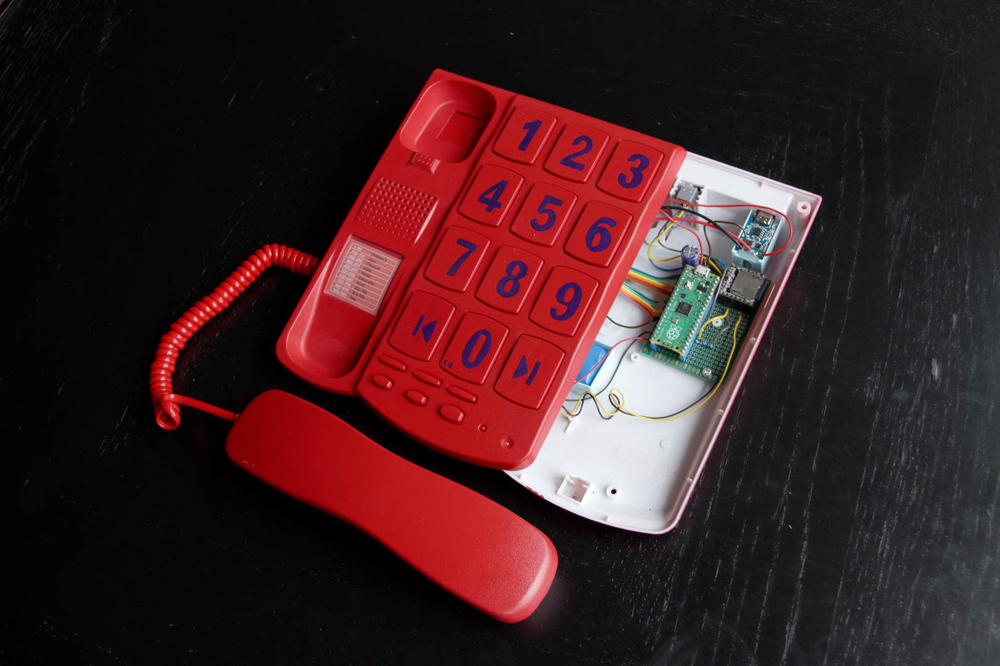
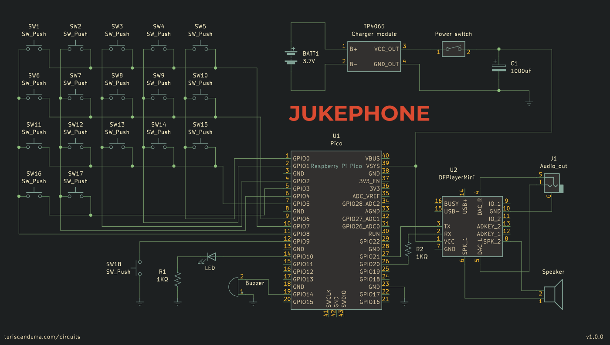

# Jukephone

## Repurposing a landline telephone into a jukebox with Raspberry Pi Pico and an Mp3 player.


See it in action: [YouTube video](https://www.youtube.com/watch?v=nJ-X3f9ios0)

### How it works

I found a big button corded telephone and decided to paint it red and turn it into a jukebox.
A Raspberry Pi Pico is used to read the keypresses, process the input, send the Mp3 player instructions via UART, and provide feedback through the LED and buzzer.
The output pins of the Mp3 player are connected to the speaker inside the headset. There's also a 3.5" mini-jack port, to use headphones. The switch below the handset is used as a power switch.
The whole Jukephone is powered by a lithium battery rechargeable via USB.
I loaded the MicroSD card with 999 Mp3 files, organized so that there's one hundred per genre (except the first one). Specific tracks can be invoked by typing their number on the keypad.
Other available functions are:

- Previous / Next track
- Adjust volume
- Pause / Resume
- Play a random track (with no repeats)
- Change equalizer settings (5 presets available)
- Repeat single track on / off
- Restart current track

### Required libraries

The code uses a few libraries I wrote or ported.

- [RP2040-Keypad-Matrix](https://github.com/TuriSc/RP2040-Keypad-Matrix), to poll the keypad matrix, detecting short and long key presses.
- [RP2040-DFPlayer](https://github.com/TuriSc/RP2040-DFPlayer), to control the Mp3 player.
- [RP2040-Button](https://github.com/TuriSc/RP2040-Button), to control the push button not part of the matrix.
- [RP2040-Battery-Check](https://github.com/TuriSc/RP2040-Battery-Check), which rapidly flashes the LED when it's time to recharge the battery.
- [RP2040-PWM-Tone](https://github.com/TuriSc/RP2040-PWM-Tone), to buzz the buzzer / beep the beeper.

### Schematic and BOM

- Landline telephone (I'm afraid rotary dials are not covered here)
- Raspberry Pi Pico
- DFPlayer mini (or MP3-TF-16P clone) - MH2024K-24K, MH2024K-16SS and many more chips are supported
- MicroSD card. 8GB or more is recommended.
- TP4056 battery charger module
- 18650 or equivalent lithium battery
- 1000uF electrolytic capacitor
- 2x 1K resistor
- 3.5" audio socket



The specific telephone I used had a keypad matrix with 17 keys, an LED, a buzzer, and another key not on the matrix. You should be able to adapt the code to your hardware.

Among the telephone components you should be able to use the keypad matrix, headset speaker, headset switch, buzzer, LED, as well as most of the wiring and connectors.

### MicroSD card structure

A typical setup would have the player read Mp3 files off a microSD card (formatted as FAT-32), with the audio files at the root level and named sequentially starting with four digits. So, for example:

```
- root
    - 0001-file name here.mp3
    - 0002-no file name after digits is ok too.mp3
    - 0003.mp3
```

### Installation
Pre-compiled builds for Raspberry Pi Pico (RP2040) and Raspberry Pi Pico 2 (RP2350) are provided in [/dist](dist).
Assuming you didn't make any changes to the circuit, you can simply flash the correct firmware. If you need to change your configuration, you'll have to build the project from these sources.

### Compiling

Required: make sure the [Pico SDK](https://github.com/raspberrypi/pico-sdk) is installed and accessible.

```shell
git clone https://github.com/TuriSc/Jukephone
cd Jukephone
git submodule init
mkdir build && cd build
cmake .. && make
```

After that, simply connect your Pico to your computer via USB holding the BOOTSEL button and copy the .uf2 file to flash the program.

### More info

Jukebox is an original project. More info and pictures on my blog: [turiscandurra.com/circuits](https://turiscandurra.com/circuits)

### Version history
- 2023.10.23 - v1.0.1 - Lowered default volume to the absolute minimum
- 2023-10-04 - v1.0.0 - First release
